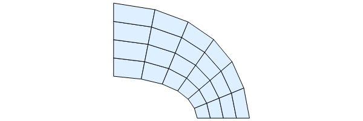

# ImportMesh

Utilities for importing FEM meshes to Mathematica. Currently supported file formats:

- .inp ([Abaqus](https://www.3ds.com/products-services/simulia/products/abaqus/))
- .mes ([Elfen](http://www.rockfieldglobal.com/))
- .msh ([Gmsh](http://gmsh.info/))
- .mphtxt ([Comsol](https://www.comsol.com/))

## Installation

The following description is for people who just want to use the package functionality and
are not interested in package development.

To use _ImportMesh_ package you need Mathematica version 11. or later.

_ImportMesh_ package is released in the `.paclet` file format, which contains code,
documentation and other necessary resources.
Download the latest `.paclet` file from the repository ["releases"](https://github.com/c3m-labs/ImportMesh/releases) page
to your computer and install it by evaluating the following command in the Mathematica:

````mathematica
(* This built-in package is usually loaded automatically at kernel startup. *)
Needs["PacletManager`"]

(* Path to .paclet file downloaded from repository "releases" page. *)
PacletInstall["full/path/to/ImportMesh-X.Y.Z.paclet"]
````

This will permanently install the _ImportMesh_ package to `$UserBasePacletsDirectory`.
To update the documentation it may be necessary to restart Mathematica.
Mathematica will always use the latest installed version of package and all installed versions
can be enumerated by evaluating `PacletFind["ImportMesh"]`.
You can get more detailed information about the package with `PacletInformation["ImportMesh"]`.
All versions can be uninstalled with:

````mathematica
PacletUninstall["ImportMesh"]
````

Alternately load the package directly from online repository by running
`Get["https://raw.githubusercontent.com/c3m-labs/ImportMesh/master/ImportMesh.wl"]`.

## Usage

### Basic

The only (currently) public function is  `ImportMesh`. It creates `ElementMesh` object from a text file:

````mathematica
Get["ImportMesh`"]

mesh=ImportMesh["path/to/your_mesh_file"];
mesh["Wireframe"]
````


### Advanced

There are also functions in the ``"`Package`"`` subcontext that implement `ImportMesh`.
Similarly, support is added for `Import` registration, so it is possible to import a file as an
`"ElementMesh"` and get it to work as expected. For example:

````mathematica
$repURL = "https://raw.githubusercontent.com/c3m-labs/ImportMesh/master";
file = URLDownload@($repURL <> "/Tests/Gmsh/Hex8_box.msh");

mesh = Import[file, "ElementMesh"];
pic = mesh["Wireframe"["MeshElementStyle" -> FaceForm@LightBlue]]
````


Support is also provided for import as a string if the format type of the file is known:

````mathematica
inputText = ReadString@($repURL <> "/Tests/Abaqus/Quad4_annulus.inp");
mesh = ImportString[inputText, "AbaqusMesh"];
pic = mesh["Wireframe"["MeshElementStyle" -> FaceForm@LightBlue]]
````



Specific elements may also be extracted when the format is known:

````mathematica
ImportString[inpText, {"AbaqusMesh", "Elements"}]
(* {"Mesh", "MeshNodes", "MeshElements"} *)
````

````mathematica
ImportString[inpText, {"AbaqusMesh", "MeshNodes"}]
(* {{0.,1.}, {0., 1.4375}, ... } *)
````

More information on how to manipulate and visualize `ElementMesh` objects is available in official
[documentation](https://reference.wolfram.com/language/FEMDocumentation/tutorial/ElementMeshVisualization.html)

## Contributing and bug reports

You can open a new [issue](https://github.com/c3m-labs/ImportMesh/issues/new) with bug report or feature request.

Contributions to ImportMesh package are very welcome.
Guidelines on how to build paclet file from source code can be found in [CONTRIBUTING.md]( CONTRIBUTING.md ) file.
These are some things you can help with:

- Test package with different mesh files
- Provide sample mesh files from other, not yet supported, software
- Propose code improvements (style or performance)
